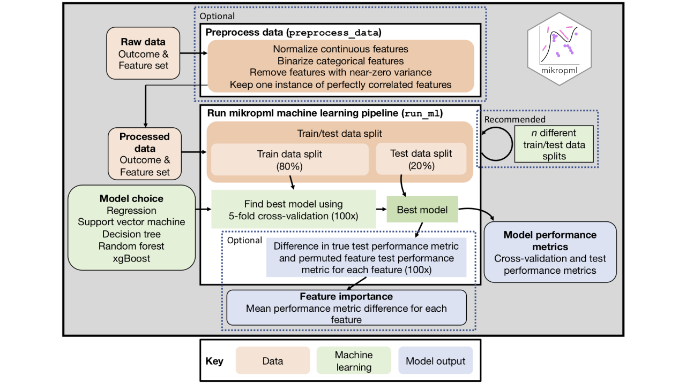

```{r setup, include=FALSE}
knitr::opts_chunk$set(
  results = 'asis',
  echo = FALSE,
  comment = FALSE,
  warning = FALSE,
  message = FALSE,
  fig.align = 'center',
  fig.path = 'figures'
)
```

<style>
#main-img-right {
 height: 5%;
}
</style>

```{r deps}
library(here)
library(knitr)
library(tidyverse)
```

# Introduction

- _C. difficile_ infection (CDI) can lead to adverse outcomes including recurrent infections, colectomy, and death [@kwon_morbidity_2015]. 
- The composition of the gut microbiome plays an important role in determining colonization resistance and clearance when exposed to _C. difficile_ [@kociolek_breakthroughs_2016; @guh_clostridioides_2018].
- Regression models trained on Electronic Health Records extracted on the day of diagnosis perform modestly well at predicting whether the CDI resulted ICU admission, colectomy, or 30-day mortality (AUROC 0.69) [@li_using_2019].
- Identifying the specific microbiome features that distinguish severe CDI cases would allow clinicians to tailor interventions based on a patient's risk, ultimately leading to better health outcomes.

**Dataset**

We have 16S amplicon sequence data from 1,191 CDI patient stool samples, with 
cases classified as severe or not severe according to three separate definitions:

  - **IDSA**: the Infectious Diseases Society of America (IDSA) definition with severe CDI having a white blood cell count ≥ 15 k/μL and serum creatinine level ≥ 1.5 mg/dL [@cohen_clinical_2010].
  - **Attributable**:  the CDC definition of ICU admission, colectomy, or death occurring within 30 days of CDI, and confirmed as attributable to CDI via clinical chart review.
  - **All-cause**: ICU admission, colectomy, or death occurring within 30 days of CDI, regardless of the cause.

```{r, message = FALSE}
read_csv('../../../data/process/outcomes_table.csv') %>% 
  kable()
```

The attributable severity definition requires chart review by physicians, which has been completed for about half of the cases.

# Methods

- Sequences were processed with mothur according to the MiSeq SOP and clustered
into _de novo_ OTUs at a 3% distance threshold [@kozich_development_2013; @schloss_introducing_2009].
- We then trained machine learning (ML) models with OTU abundances as features to
predict the IDSA severity, CDI-attributable severity, and all-cause severity of CDI cases using the mikropml R package accompanying snakemake workflow [@topcuoglu_mikropml_2021; @koster_snakemake_2012].

## Machine learning pipeline

```{r}

```

- Prior to model training, the data were pre-processed to scale and center at zero, remove features with near-zero variance, and collapse perfectly correlated features.
- The dataset was randomly split 100 times into training and testing sets with 80% of the
data in the training set.
- On each partition, random forest models were trained with 5-fold cross-validation
repeated 100 times, and performance as the area under the receiver-operator
curve (AUROC) was measured on the held-out testing set for the best model.
- The top 5 most important features contributing to model performance for each model using a permutation test.


# Results

```{r, message = FALSE}
perf_dat <- read_csv('../../../results/performance_results_aggregated.csv')  %>% 
  filter(method == 'rf') %>% 
  group_by(outcome) %>% 
  summarize(med_auroc = median(AUC)) 
med_perf <- perf_dat %>% pull(med_auroc)
names(med_perf) <- perf_dat %>% pull(outcome)
```


## Model performance

The models predicting CDI-attributable severity performed best 
(median AUROC `r round(med_perf['attrib'], 2)`), 
followed closely by those predicting all-cause severity 
(median AUROC `r round(med_perf['allcause'], 2)`).
The models predicting IDSA severity performed worst 
(median AUROC `r round(med_perf['idsa'], 2)`).

```{r}
include_graphics('../../../figures/plot_perf.png')
```

## Feature importance

The top 5 most important OTUs for predicting each outcome were determined with a permutation test.

```{r}
include_graphics('../../../figures/plot_feat_imp.png')
```

# Conclusions 

- The long tails of the performance distributions for CDI-attributable and all-cause severity may reflect the rarity of severe outcomes according to these definitions.
- That models predicting CDI-attributable severity performed best implies that chart review by physicians is an important step to filter out other causes of complications.
- The poor-to-modest performance of these OTU-based models implies that the taxonomic composition of the microbiome is not the only important factor contributing to severe CDI outcomes.

## Future directions

- Using the precision-recall curve (AUPRC) may provide a better estimate of model performance than AUROC as the data are imbalanced.
- Training models with both EHR data and OTUs as features may improve model performance.


# Acknowledgements 

This research was supported by the National Institutes of Health grant U01AI124255
and the Michigan Institute for Clinical and Health Research Postdoctoral
Translational Scholars Program (UL1TR002240 from the National Center for
Advancing Translational Sciences).

# References
